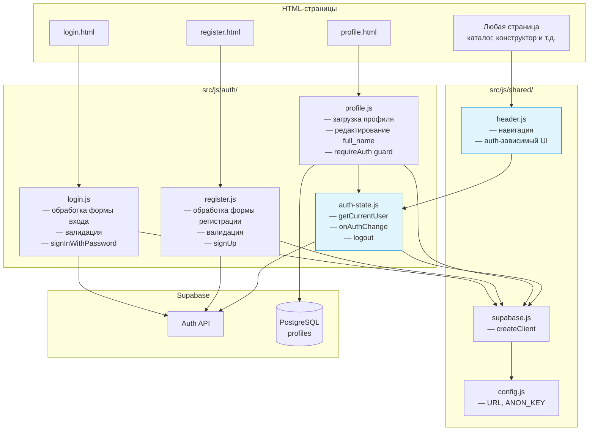
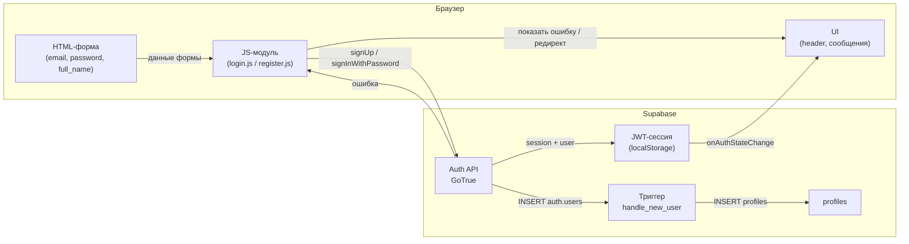
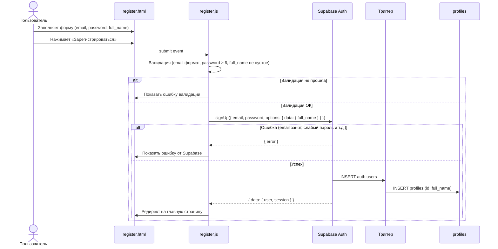
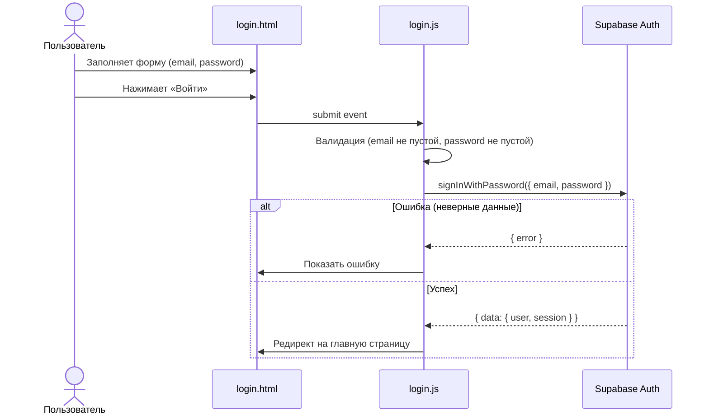
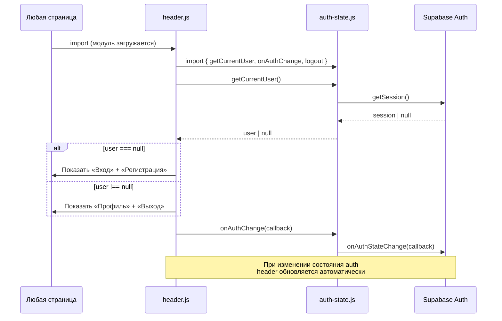
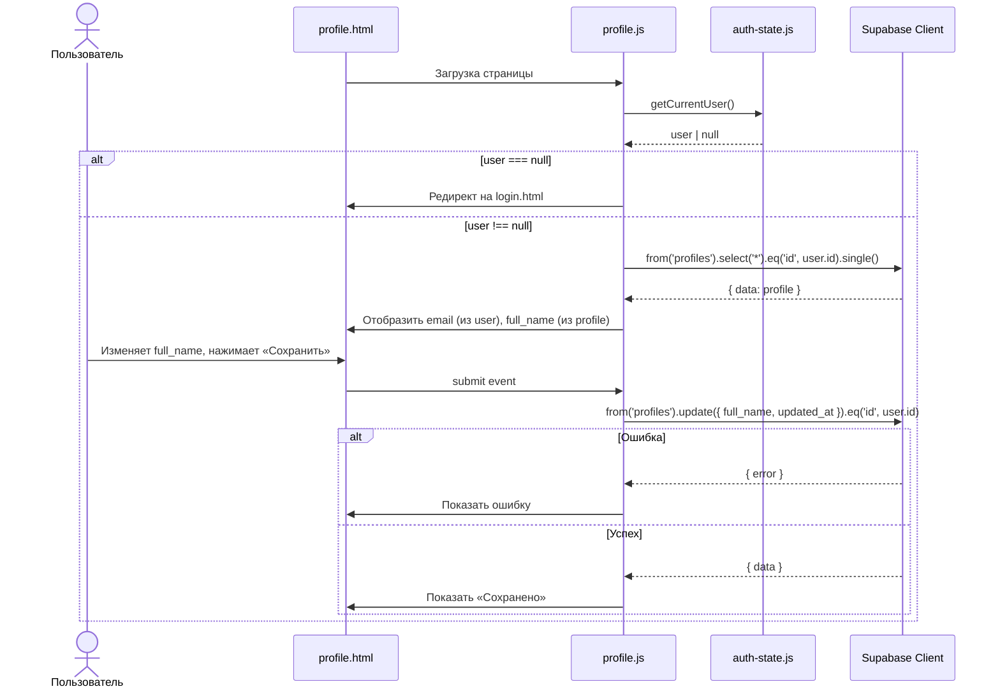

# DESIGN: Авторизация — вход и регистрация через email + Supabase Auth

**Дата:** 2026-03-09
**Фаза:** DESIGN
**Основание:** `docs/research/research_auth-email-supabase.md`

---

## 1. Диаграмма компонентов



### Описание модулей

| Модуль | Ответственность |
|---|---|
| `auth/auth-state.js` | Центральный модуль auth-состояния. Экспортирует `getCurrentUser()`, `onAuthChange(callback)`, `logout()`. Единственный модуль, который подписывается на `onAuthStateChange`. |
| `auth/login.js` | Скрипт страницы входа. Обрабатывает форму, вызывает `signInWithPassword`, показывает ошибки, редиректит при успехе. |
| `auth/register.js` | Скрипт страницы регистрации. Обрабатывает форму, вызывает `signUp` с `full_name` в `data`, показывает ошибки, редиректит при успехе. |
| `auth/profile.js` | Скрипт страницы профиля. Проверяет авторизацию (guard), загружает `profiles`, позволяет редактировать `full_name`. |
| `shared/header.js` | Универсальный модуль навигации. Подключается на **каждой** странице. Подписывается на `onAuthChange` и переключает UI: гость видит «Вход/Регистрация», авторизованный — «Профиль/Выход». |

---

## 2. Data flow



### Потоки данных

**Регистрация:**
1. Пользователь заполняет форму (email, password, full_name)
2. `register.js` валидирует на клиенте
3. `supabase.auth.signUp({ email, password, options: { data: { full_name } } })`
4. Supabase Auth создаёт запись в `auth.users`
5. Триггер `on_auth_user_created` создаёт запись в `profiles`
6. Supabase возвращает `{ data: { user, session }, error }`
7. При успехе — автоматический вход (сессия сохраняется в localStorage)
8. Редирект на главную (или на страницу, откуда пришёл)

**Вход:**
1. Пользователь заполняет форму (email, password)
2. `login.js` валидирует на клиенте
3. `supabase.auth.signInWithPassword({ email, password })`
4. Supabase возвращает `{ data: { user, session }, error }`
5. При успехе — сессия в localStorage, редирект

**Выход:**
1. Пользователь нажимает «Выход» в навигации
2. `header.js` вызывает `logout()` из `auth-state.js`
3. `supabase.auth.signOut()`
4. `onAuthStateChange` срабатывает → `header.js` обновляет UI
5. Редирект на главную

---

## 3. Sequence-диаграммы

### 3.1 Регистрация



### 3.2 Вход



### 3.3 Загрузка страницы (auth-state + header)



### 3.4 Профиль



---

## 4. Изменения в схеме БД

**Новых таблиц, полей и RLS-политик НЕ ТРЕБУЕТСЯ.**

Всё необходимое уже определено в `001_initial_schema.sql`:
- Таблица `profiles` с полями `id`, `full_name`, `avatar_url`, `created_at`, `updated_at`
- Триггер `on_auth_user_created` → `handle_new_user()`
- RLS-политики на `profiles` (SELECT, INSERT, UPDATE — только свои)

---

## 5. ADR: Архитектурные решения

### ADR-1: Подтверждение email

**Контекст:** Supabase Auth по умолчанию отправляет confirmation email при регистрации. Пока письмо не подтверждено, `signUp` возвращает user, но не создаёт сессию.

**Варианты:**
| Вариант | Плюсы | Минусы |
|---|---|---|
| A: Включить подтверждение | Защита от фейковых email | Требует настройки SMTP, усложняет UX для учебного проекта |
| B: Отключить подтверждение | Мгновенная регистрация, простота | Можно зарегистрироваться с любым email |

**Решение:** Вариант B — отключить подтверждение email.

**Обоснование:** Учебный проект, нет production-требований к верификации. Настройка: Supabase Dashboard → Authentication → Settings → отключить «Enable email confirmations». При необходимости включается одним чекбоксом без изменения кода.

---

### ADR-2: Управление навигацией (auth-зависимый UI)

**Контекст:** Навигация (header) должна меняться в зависимости от авторизации: гость видит «Вход/Регистрация», авторизованный — «Профиль/Выход». Header нужен на каждой странице.

**Варианты:**
| Вариант | Плюсы | Минусы |
|---|---|---|
| A: Дублировать HTML header на каждой странице | Простота, нет JS-зависимости для структуры | Дублирование, сложно поддерживать |
| B: JS-модуль `shared/header.js` динамически управляет header | Единый источник, автоматическое обновление при смене auth-состояния | Требует `<header>` контейнер на каждой странице |

**Решение:** Вариант B — `shared/header.js`.

**Обоснование:** Header-HTML пишется на каждой странице (для SEO и контента без JS), но `header.js` управляет auth-зависимыми элементами: показывает/скрывает ссылки через `display: none` и привязывает обработчик выхода. Контейнер `<header>` с фиксированной разметкой обоих вариантов (гость/авторизованный) присутствует в HTML, JS только переключает видимость.

---

### ADR-3: Централизация auth-состояния

**Контекст:** Несколько модулей зависят от auth-состояния: header, profile, будущая корзина. Нужен единый способ получать текущего пользователя.

**Варианты:**
| Вариант | Плюсы | Минусы |
|---|---|---|
| A: Каждый модуль сам вызывает `supabase.auth.getSession()` | Нет дополнительного модуля | Дублирование, несколько подписок на `onAuthStateChange` |
| B: Единый модуль `auth-state.js` | Одна подписка, консистентный API, переиспользуемость | Дополнительный модуль |

**Решение:** Вариант B — `auth/auth-state.js`.

**Обоснование:** Единая точка подписки `onAuthStateChange` предотвращает конфликты и дублирование. Модуль экспортирует минимальный API:
- `getCurrentUser()` → `Promise<User|null>` — получить текущего пользователя
- `onAuthChange(callback)` → `{ unsubscribe }` — подписаться на изменения
- `logout()` → `Promise<void>` — выход

---

### ADR-4: Стратегия редиректа после авторизации

**Контекст:** После входа/регистрации пользователя нужно перенаправить.

**Варианты:**
| Вариант | Плюсы | Минусы |
|---|---|---|
| A: Всегда на главную | Просто | Теряется контекст (откуда пришёл) |
| B: На предыдущую страницу (через `?redirect=` query-параметр) | Удобно для пользователя | Чуть сложнее |

**Решение:** Вариант B — redirect через query-параметр.

**Обоснование:** Когда guard на странице профиля (или будущей корзины) перенаправляет на login, он добавляет `?redirect=/pages/profile.html`. После успешного входа `login.js` читает этот параметр и делает редирект. Если параметра нет — редирект на главную (`/`). Минимальная сложность, большой выигрыш в UX.

---

## 6. Файловая структура (итог)

```
src/
├── js/
│   ├── auth/
│   │   ├── auth-state.js    ← центральный модуль auth-состояния
│   │   ├── login.js         ← логика страницы входа
│   │   ├── register.js      ← логика страницы регистрации
│   │   └── profile.js       ← логика страницы профиля
│   └── shared/
│       ├── config.js        ← уже есть
│       ├── supabase.js      ← уже есть
│       └── header.js        ← НОВЫЙ: навигация + auth UI
├── css/
│   └── auth.css             ← стили форм авторизации
└── pages/
    ├── login.html           ← страница входа
    ├── register.html        ← страница регистрации
    └── profile.html         ← страница профиля
```

---

## 7. Чеклист перед выходом из DESIGN

- [x] Модульность соблюдена: auth-логика в `auth/`, shared-утилиты в `shared/`
- [x] RLS-политики — новые не нужны, существующие покрывают все операции
- [x] Серверная логика не добавляется — всё на клиенте через Supabase SDK
- [x] Sequence-диаграммы логичны и покрывают все сценарии (регистрация, вход, загрузка страницы, профиль)
- [x] ADR задокументированы для всех нетривиальных решений