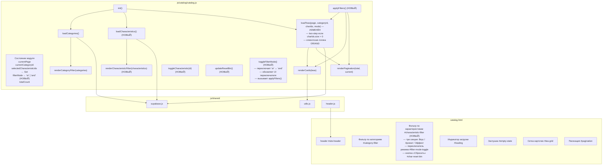
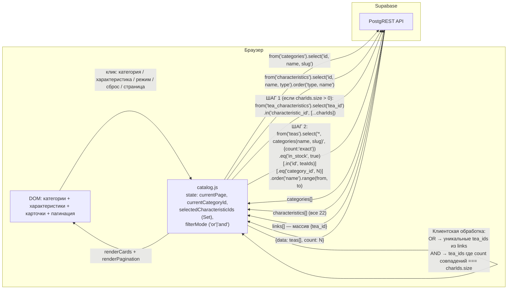
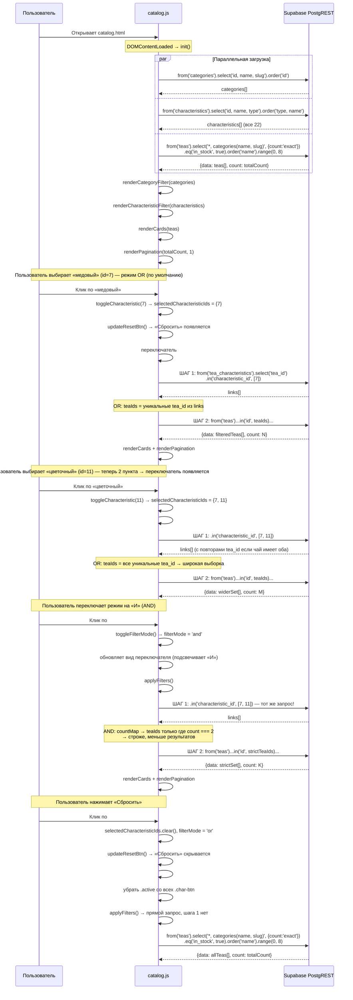

# DESIGN: Фильтрация каталога по категории и вкусовому профилю через characteristics

**Дата:** 2026-03-11
**Фаза:** DESIGN
**Задача:** Фильтрация каталога: по категории и вкусовому профилю через characteristics
**Research:** `docs/research/research_catalog-filter-characteristics.md`

---

## 1. Диаграмма компонентов



### Новые и изменённые элементы

| Элемент | Тип | Описание |
|---|---|---|
| `#characteristic-filter` | HTML | Новый блок — три секции + переключатель режима + кнопка сброса |
| `#filter-mode-toggle` | HTML | Кнопка-переключатель «ИЛИ / И», скрыта если выбрано ≤ 1 характеристики |
| `#char-reset-btn` | HTML | Кнопка «Сбросить», скрыта если ничего не выбрано |
| `selectedCharacteristicIds` | JS state | `Set<number>` — выбранные ID характеристик |
| `filterMode` | JS state | `'or'` (по умолчанию) \| `'and'` — режим объединения фильтров |
| `loadCharacteristics()` | JS function | SELECT все 22 записи из `characteristics` |
| `renderCharacteristicFilter()` | JS function | Группирует по `type`, рендерит три секции + переключатель |
| обработчик `change` на чекбоксах | JS event | Читает `checkbox.checked`, синхронизирует `selectedCharacteristicIds`, вызывает `applyFilters()` |
| `updateResetBtn()` | JS function | Показывает `#char-reset-btn` если Set непуст |
| `updateFilterModeToggle()` | JS function | Показывает/скрывает переключатель режима при size >= 2 |
| `toggleFilterMode(mode)` | JS function | Переключает `filterMode`, обновляет UI переключателя, вызывает `applyFilters()` |
| `applyFilters()` | JS function | Сбрасывает страницу, вызывает `loadTeas` + рендер |
| `loadTeas()` | JS function (изменён) | Two-step при `charIds.size > 0`, клиентская OR/AND логика |

---

## 2. Data flow



### Условная логика `loadTeas` — четыре ветки

| `categoryId` | `charIds` | Запрос |
|---|---|---|
| `null` | `Set{}` | Прямой запрос без фильтров |
| `3` | `Set{}` | Прямой + `.eq('category_id', 3)` |
| `null` | `Set{7, 10}` | Шаг 1 → клиентский OR/AND → Шаг 2 `.in('id', teaIds)` |
| `3` | `Set{7, 10}` | Шаг 1 → клиентский OR/AND → Шаг 2 `.in('id', teaIds).eq('category_id', 3)` |

### Клиентская логика разделения OR / AND (Шаг 1 → teaIds)

Оба режима выполняют **один и тот же запрос** к `tea_characteristics`. Разница — в клиентской обработке результата:

```
links = [{tea_id: 1}, {tea_id: 1}, {tea_id: 5}, {tea_id: 12}, ...]
                   ↑ tea_id=1 встретился дважды — у него есть оба char_id 7 и 10

OR:  teaIds = уникальные tea_id из links
     → [1, 5, 12, ...] — все чаи, у которых есть хотя бы один из выбранных пунктов

AND: countMap = {1: 2, 5: 1, 12: 1, ...}
     teaIds = те, у кого count === charIds.size (=2)
     → [1] — только чаи, у которых есть ВСЕ выбранные пункты
```

---

## 3. Sequence-диаграмма



---

## 4. Изменения в схеме БД

**Не требуются.** Все таблицы, связи и RLS-политики уже существуют:

| Таблица | Политика | Статус |
|---|---|---|
| `characteristics` | `FOR SELECT USING (true)` | Есть |
| `tea_characteristics` | `FOR SELECT USING (true)` | Есть |
| `teas` | `FOR SELECT USING (true)` | Есть |
| `categories` | `FOR SELECT USING (true)` | Есть |

Индекс `idx_characteristics_type ON characteristics (type)` — уже создан в миграции.

---

## 5. ADR: Архитектурные решения

### ADR-1: Все три типа характеристик в фильтре, сгруппированные по типу

**Контекст:** В таблице `characteristics` три типа: `taste` (10), `aroma` (7), `effect` (5) — всего 22.

**Решение:** Все 22 характеристики, сгруппированные в три секции: «Вкус», «Аромат», «Эффект».

**Обоснование:**
- Проект рассчитан на рост каталога — со временем ассортимент расширится. Фильтр по аромату и эффекту будет востребован уже при 30–50 чаях
- Три секции по 7–10 кнопок с горизонтальной прокруткой — не перегружают UI
- Группировка помогает пользователю понять семантику: не «медовый» вообще, а «медовый *вкус*»
- `loadCharacteristics()` делает один запрос без фильтра по типу — группировку выполняет клиентская функция `renderCharacteristicFilter()`

**Структура UI:**
```
[Вкус]    [ягодный] [фруктовый] [цитрусовый] ... (прокрутка)
[Аромат]  [цветочный] [пряный] [травяной] ... (прокрутка)
[Эффект]  [бодрящий] [расслабляющий] ... (прокрутка)
                     [ИЛИ / И]  [Сбросить фильтры]
```

---

### ADR-2: Multi-select через двухэтапный запрос (two-step approach)

**Контекст:** Supabase SDK v2 не поддерживает `.in()` на полях embedded-таблицы при `!inner` join (`.in('tea_characteristics.characteristic_id', [...])` не работает).

**Решение:** Two-step approach.

**Шаг 1 — получить tea_id из `tea_characteristics`:**
```js
const { data: links } = await supabase
  .from('tea_characteristics')
  .select('tea_id')
  .in('characteristic_id', [...selectedCharacteristicIds]);
```

**Шаг 2 — запросить чаи по teaIds (после клиентской OR/AND обработки):**
```js
supabase
  .from('teas')
  .select('*, categories(name, slug)', { count: 'exact' })
  .eq('in_stock', true)
  .in('id', teaIds)
  .order('name')
  .range(from, to)
```

**Обоснование:**
- Самый распространённый паттерн в Supabase-сообществе для M:N multi-select
- Оба запроса — стандартные операторы SDK, никакого RPC или raw SQL
- `.in()` на `characteristic_id` — прямой фильтр по колонке, работает корректно
- `.in('id', teaIds)` — по первичному ключу, O(1) на индексе
- `count: 'exact'` на шаге 2 учитывает teaIds → пагинация корректна

**Альтернативы:**

| Вариант | Почему не выбран |
|---|---|
| `!inner` join + `.eq()` (single-select) | Не поддерживает multi-select |
| `!inner` join + `.in()` на embedded-поле | Не работает в Supabase SDK v2 |
| RPC (PostgreSQL-функция) | Требует серверную логику — противоречит архитектуре |
| N запросов + клиентское пересечение | Лишние round-trip; two-step даёт то же через один запрос к `tea_characteristics` |

---

### ADR-3: Единая функция `applyFilters()`

**Контекст:** Логика перезагрузки (loadTeas → renderCards → renderPagination) будет нужна из четырёх мест: категория, характеристика, переключатель режима, пагинация.

**Решение:** Единая `applyFilters()`, которая читает весь текущий state и выполняет запрос.

**Обоснование:**
- Все обработчики кликов обновляют только свою часть состояния, затем вызывают `applyFilters()`
- Two-step логика и OR/AND обработка находятся в одном месте — `loadTeas()`
- Устраняет риск рассинхронизации между фильтрами

---

### ADR-4: Two-step — `count: 'exact'` только на шаге 2

**Контекст:** Пагинация требует точного счётчика. При two-step подходе count нужен только для финального набора чаёв.

**Решение:** `count: 'exact'` — только в запросе к `teas` (шаг 2). Шаг 1 (`tea_characteristics`) без count.

**Граничный случай:** если после клиентской обработки `teaIds` пуст (ни один чай не удовлетворяет условию AND) — шаг 2 не выполняется, `loadTeas` сразу возвращает `{ data: [], count: 0 }`.

---

### ADR-5: `selectedCharacteristicIds` как `Set<number>`

**Решение:** `const selectedCharacteristicIds = new Set()` — модуль-уровневая переменная.

**Обоснование:**
- `Set.has(id)` — O(1) для проверки активности кнопки при рендере
- `Set.add(id)` / `Set.delete(id)` — чистый toggle без `.indexOf()` / `.filter()`
- `[...set]` — тривиальное преобразование в массив для `.in()`
- `set.size` — проверка «ничего не выбрано» и «больше одного» (для показа переключателя)

---

### ADR-6: Переключатель режима OR / AND

**Контекст:** Пользователь может хотеть либо расширить выборку («покажи всё, где есть хотя бы один из выбранных пунктов»), либо сузить её («покажи только то, где все выбранные пункты есть одновременно»). Оба режима полезны для разных сценариев:
- OR: «хочу фруктовый ИЛИ ягодный» — исследование
- AND: «хочу чай, который одновременно бодрит и расслабляет» — точный подбор

**Решение:** Переключатель в виде кнопки с двумя состояниями — «ИЛИ» и «И». Состояние хранится в `filterMode: 'or' | 'and'`.

**Поведение переключателя:**
- Скрыт, если выбрана 0 или 1 характеристика (режим не влияет на результат при ≤ 1 пункте)
- Появляется, когда `selectedCharacteristicIds.size >= 2`
- Сбрасывается в `'or'` при нажатии «Сбросить фильтры»

**Почему клиентская обработка, а не два разных запроса к Supabase:**
- Шаг 1 одинаков в обоих режимах: `.in('characteristic_id', [...ids])` к `tea_characteristics`
- Разница — только в том, как трактовать результат:
  - OR: `[...new Set(links.map(l => l.tea_id))]`
  - AND: `links` → `countMap` → оставить только `tea_id`, где count === `charIds.size`
- Это один запрос + несколько строк клиентского JavaScript — нет смысла усложнять запрос к БД

**Реализация OR/AND на клиенте:**
```
links = результат шага 1 = массив {tea_id}
(tea_id может повторяться, если у чая несколько выбранных характеристик)

OR режим:
  teaIds = [...new Set(links.map(l => l.tea_id))]

AND режим:
  countMap = Map<tea_id, число совпадений>
  for each link: countMap.set(tea_id, (countMap.get(tea_id) ?? 0) + 1)
  teaIds = [...countMap.entries()]
    .filter(([, count]) => count === charIds.size)
    .map(([id]) => id)
```

Оба варианта: O(n) по количеству строк из шага 1. При 18 чаях и 22 характеристиках — максимум ~90 строк в `tea_characteristics`.

**UI переключателя:**
```
[ИЛИ]  — неактивный режим: приглушён
[И]    — активный режим: подсвечен (аналог .active)
```
Или единая кнопка с текстом, который меняется: «Режим: ИЛИ → нажмите для И».

Выбор конкретного UI (два сегмента / одна кнопка) — на усмотрение при реализации.

---

## 6. Структура HTML — новый блок

```
catalog.html
├── <main class="catalog-page">
│   ├── <h1> — «Каталог чаёв»
│   ├── <div id="category-filter">           — кнопки категорий (существует)
│   ├── <div id="characteristic-filter">      — фильтр характеристик (НОВЫЙ)
│   │   ├── <div class="char-group" data-type="taste">
│   │   │   ├── <span class="char-group__label">Вкус</span>
│   │   │   └── <div class="char-group__checkboxes">
│   │   │       ├── <input type="checkbox" id="char-1" class="char-check" value="1">
│   │   │       ├── <label for="char-1" class="char-label">ягодный</label>
│   │   │       └── ... (пары input+label для каждой характеристики)
│   │   ├── <div class="char-group" data-type="aroma">
│   │   │   ├── <span class="char-group__label">Аромат</span>
│   │   │   └── <div class="char-group__checkboxes"> ... (пары input+label)
│   │   ├── <div class="char-group" data-type="effect">
│   │   │   ├── <span class="char-group__label">Эффект</span>
│   │   │   └── <div class="char-group__checkboxes"> ... (пары input+label)
│   │   └── <div class="char-controls">      — отдельный блок управления
│   │       ├── <div id="filter-mode-toggle" hidden>  — появляется при size >= 2
│   │       │   ├── <button class="mode-btn active" data-mode="or">ИЛИ</button>
│   │       │   └── <button class="mode-btn" data-mode="and">И</button>
│   │       └── <button id="char-reset-btn" hidden>Сбросить фильтры</button>
│   ├── <div id="loading">
│   ├── <div id="empty-state" hidden>
│   ├── <div id="tea-grid" class="tea-grid">
│   └── <nav id="pagination">
```

> Чекбоксы и переключатель «ИЛИ / И» намеренно разделены:
> - Чекбоксы — в `.char-group__checkboxes` каждой секции (что выбрать)
> - Переключатель режима + «Сбросить» — в `.char-controls` (как объединять выбранное)
> Это разделение смысловое: сначала пользователь выбирает характеристики, затем управляет режимом.

---

## 7. CSS — новые стили

| Селектор | Описание |
|---|---|
| `#characteristic-filter` | `display: flex; flex-direction: column; gap: 10px; margin-bottom: 20px;` |
| `.char-group` | `display: flex; align-items: center; gap: 8px;` |
| `.char-group__label` | `font-size: 0.75rem; font-weight: 600; color: #795548; white-space: nowrap; min-width: 52px;` |
| `.char-group__checkboxes` | `display: flex; gap: 6px; overflow-x: auto; flex: 1; flex-wrap: nowrap;` + скрытый скроллбар |
| `.char-check` | `position: absolute; opacity: 0; width: 0; height: 0;` — нативный чекбокс скрыт |
| `.char-label` | Стилизованная таблетка: `border-radius: 16px; border: 2px solid #795548; padding: 4px 12px; font-size: 0.8125rem; background: #fff; color: #795548; cursor: pointer; user-select: none;` |
| `.char-label:hover` | `background-color: #efebe9;` |
| `.char-check:checked + .char-label` | `background-color: #795548; color: #fff;` — состояние «выбрано» без JS |
| `.char-check:checked + .char-label:hover` | `background-color: #6d4c41;` |
| `.char-controls` | `display: flex; align-items: center; gap: 12px; justify-content: flex-end; margin-top: 8px; padding-top: 8px; border-top: 1px solid #efebe9;` |
| `#filter-mode-toggle` | `display: flex; border: 2px solid #795548; border-radius: 16px; overflow: hidden;` |
| `.mode-btn` | `padding: 3px 10px; font-size: 0.75rem; font-weight: 600; background: #fff; color: #795548; border: none; cursor: pointer;` |
| `.mode-btn.active` | `background-color: #795548; color: #fff;` |
| `#char-reset-btn` | `font-size: 0.8125rem; color: #795548; background: none; border: none; cursor: pointer; text-decoration: underline; padding: 0;` |

**Ключевой принцип CSS:** состояние «выбрано» управляется через `:checked + .char-label` — браузер
переключает его сам при клике по `<label>`. JS только синхронизирует `selectedCharacteristicIds`.

**Визуальное разделение `.char-controls`:** строка с переключателем и кнопкой сброса отделена от
секций чекбоксов линией `border-top`. Это подчёркивает, что `.char-controls` — это управление
режимом, а не ещё один набор параметров для выбора.

**Цветовая дифференциация:** категории — зелёные (`#2e7d32`), характеристики — коричневые (`#795548`).

---

## 8. Состояния UI (обновлённые)

| Состояние | Что показываем |
|---|---|
| Загрузка | `#loading` виден, `#tea-grid` скрыт |
| Данные загружены | `#loading` скрыт, карточки в `#tea-grid` |
| Выбрана 1 характеристика | `#char-reset-btn` виден; `#filter-mode-toggle` скрыт |
| Выбрано ≥ 2 характеристики | `#char-reset-btn` и `#filter-mode-toggle` видны |
| Пустой результат | `#empty-state`: «Чаёв с такими параметрами не найдено» |
| Ошибка | `#empty-state` с текстом ошибки |

---

## 9. Чек-лист перед PLAN

- [x] Модульность не нарушена — все изменения внутри `catalog.js`, `catalog.html`, `catalog.css`
- [x] RLS учтены — новые таблицы не добавляются, публичное чтение разрешено
- [x] Серверная логика не добавляется — two-step + OR/AND на клиенте
- [x] Sequence-диаграмма логична — включает сценарии переключения режима
- [x] Пагинация корректна — `count: 'exact'` на шаге 2
- [x] Граничный случай пустого teaIds (AND при несовместимых фильтрах) обработан
- [x] Переключатель скрыт при ≤ 1 выбранной характеристике — не запутывает пользователя
- [x] Сброс возвращает `filterMode = 'or'` — предсказуемое поведение
- [x] Адаптивность — горизонтальная прокрутка внутри каждой группы