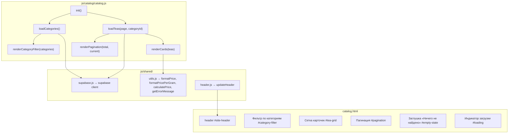
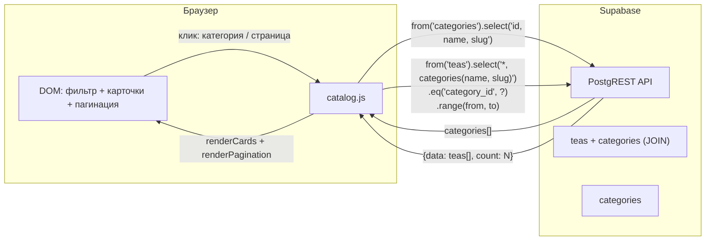
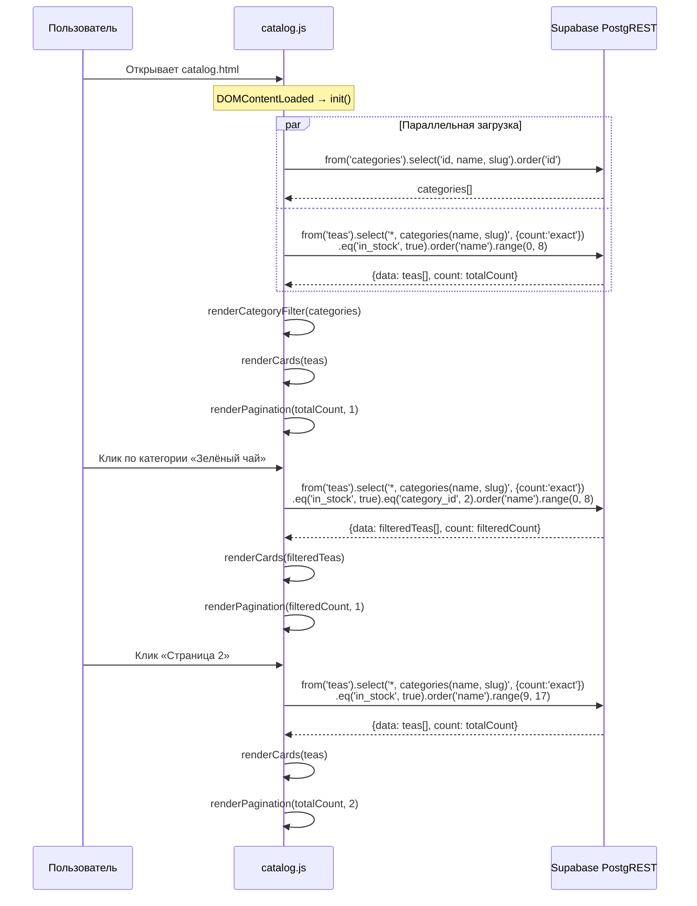

# DESIGN: Каталог чаёв — список карточек, пагинация, данные из таблицы teas

**Дата:** 2026-03-11
**Фаза:** DESIGN
**Задача:** Каталог чаёв: список карточек, пагинация, данные из таблицы teas
**Research:** `docs/research/research_catalog-teas.md`

---

## 1. Диаграмма компонентов



---

## 2. Data flow



### Данные на карточке чая

| Поле из `teas` | Отображение |
|---|---|
| `image_url` | Изображение (или placeholder) |
| `name` | Название |
| `description` | Краткое описание (обрезано до ~80 символов) |
| `categories.name` | Бейдж категории |
| `price_per_gram` | Цена за грамм (`formatPricePerGram`) |
| `weight_grams` | Фасовка: «50 г» |
| `price_per_gram × weight_grams` | Итоговая цена (`calculatePrice` → `formatPrice`) |
| `in_stock` | Визуальная индикация (если `false` — карточка приглушена) |

---

## 3. Sequence-диаграмма: загрузка каталога



---

## 4. Изменения в схеме БД

**Не требуются.** Все необходимые таблицы и RLS-политики уже существуют:

- `teas` — `FOR SELECT USING (true)`
- `categories` — `FOR SELECT USING (true)`
- Индекс `idx_teas_category ON teas (category_id)` — уже создан

---

## 5. ADR: Архитектурные решения

### ADR-1: Один модуль `catalog.js` вместо разделения на data/render/pagination

**Контекст:** Можно разделить каталог на несколько модулей (`catalog-data.js`, `catalog-render.js`, `catalog-pagination.js`) или оставить один `catalog.js`.

**Решение:** Один модуль `catalog.js`.

**Обоснование:**
- 18 чаёв, 7 категорий — масштаб минимальный
- Весь функционал: загрузка, рендер, фильтрация, пагинация — тесно связан
- Разделение на 3 модуля для ~150-200 строк кода — overengineering
- Если каталог вырастет, можно будет разделить позже

---

### ADR-2: Пагинация через `.range()` (offset-based)

**Контекст:** Supabase поддерживает offset-based (`.range()`) и cursor-based пагинацию.

**Решение:** Offset-based через `.range(from, to)` + `{ count: 'exact' }`.

**Обоснование:**
- 18 записей — offset-пагинация работает эффективно
- `.range()` позволяет перейти к любой странице напрямую (не только «вперёд/назад»)
- `count: 'exact'` нужен для отображения общего числа страниц (один дополнительный COUNT-запрос на стороне PostgREST, не отдельный вызов)
- Cursor-based оправдан при тысячах записей — здесь избыточен

---

### ADR-3: Фильтрация по категориям — кнопки-табы

**Контекст:** Фильтр по категории можно сделать как: выпадающий список (`<select>`), набор кнопок-табов, или боковую панель с чекбоксами.

**Решение:** Горизонтальный ряд кнопок-табов с кнопкой «Все».

**Обоснование:**
- 7 категорий + «Все» = 8 кнопок — помещается в одну строку на desktop
- На мобильных — горизонтальный скролл (`overflow-x: auto`)
- Визуально нагляднее `<select>`: пользователь сразу видит все категории
- Активная категория подсвечена — понятно текущее состояние

---

### ADR-4: Количество карточек на странице — 9

**Контекст:** Нужно выбрать `PAGE_SIZE` для пагинации.

**Решение:** 9 элементов на странице.

**Обоснование:**
- Grid 3×3 на desktop — визуально завершённая сетка
- 18 чаёв / 9 = 2 страницы — достаточно для демонстрации пагинации
- На планшете — 2 колонки (4-5 рядов), на мобильном — 1 колонка (9 рядов) — приемлемо

---

### ADR-5: Обработка отсутствующих изображений

**Контекст:** Все `image_url` в seed-данных — NULL. Нужно решить, что показывать.

**Решение:** CSS-placeholder через `background-color` + иконку чашки (символ или SVG inline).

**Обоснование:**
- Не требует дополнительных файлов-изображений
- Работает без интернета (в отличие от внешнего placeholder-сервиса)
- Если позже `image_url` заполнится — `` перекроет placeholder
- Реализация: блок `.tea-card__image` с `background` по умолчанию; если `image_url !== null`, внутри рендерится ``

---

## 6. Структура HTML (семантика)

```
catalog.html
├── <header id="site-header"> — шапка (из паттерна login.html)
├── <main class="catalog-page">
│   ├── <h1> — «Каталог чаёв»
│   ├── <div id="category-filter"> — кнопки категорий
│   │   ├── <button class="active" data-category="all"> Все
│   │   ├── <button data-category="1"> Чёрный чай
│   │   └── ...
│   ├── <div id="loading"> — индикатор загрузки
│   ├── <div id="empty-state" hidden> — «Ничего не найдено»
│   ├── <div id="tea-grid" class="tea-grid"> — CSS Grid контейнер
│   │   └── <article class="tea-card"> × N
│   │       ├── <div class="tea-card__image"> — изображение/placeholder
│   │       ├── <span class="tea-card__category"> — бейдж категории
│   │       ├── <h2 class="tea-card__name"> — название
│   │       ├── <p class="tea-card__description"> — описание (обрезанное)
│   │       ├── <div class="tea-card__pricing">
│   │       │   ├── <span class="tea-card__price"> — итоговая цена
│   │       │   └── <span class="tea-card__price-per-gram"> — цена за грамм
│   │       └── <span class="tea-card__weight"> — «50 г»
│   └── <nav id="pagination" aria-label="Страницы"> — пагинация
│       ├── <button class="pagination__btn" data-page="prev"> ←
│       ├── <button class="pagination__btn pagination__btn--active" data-page="1"> 1
│       ├── <button class="pagination__btn" data-page="2"> 2
│       └── <button class="pagination__btn" data-page="next"> →
```

---

## 7. CSS Grid — адаптивность

| Breakpoint | Колонки | Описание |
|---|---|---|
| ≥ 960px | 3 колонки | Desktop: `grid-template-columns: repeat(3, 1fr)` |
| 600–959px | 2 колонки | Планшет: `repeat(2, 1fr)` |
| 375–599px | 1 колонка | Мобильный: `1fr` |

Фильтр категорий на мобильных: `overflow-x: auto`, `white-space: nowrap`, `gap: 8px`.

---

## 8. Состояния UI

| Состояние | Что показываем |
|---|---|
| Загрузка | `#loading` виден, `#tea-grid` скрыт |
| Данные загружены | `#loading` скрыт, `#tea-grid` с карточками |
| Пустой результат (фильтр) | `#empty-state` виден: «В этой категории пока нет чаёв» |
| Ошибка загрузки | `#empty-state` с текстом ошибки из `getErrorMessage()` |

---

## 9. Чек-лист перед PLAN

- [x] Модульность не нарушена — `catalog.js` в `src/js/catalog/`, импортирует только из `shared/`
- [x] RLS учтены — новые таблицы не добавляются, существующие политики публичного чтения достаточны
- [x] Серверная логика не добавляется — всё на клиенте через Supabase SDK
- [x] Sequence-диаграмма логична — параллельная загрузка категорий и чаёв, далее рендер
- [x] Учтён placeholder для отсутствующих изображений
- [x] Адаптивность от 375px запланирована
