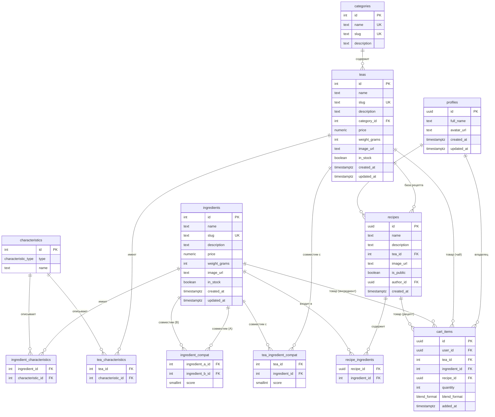

# Схема базы данных TeaShop

## Обзор

12 таблиц, нормализация до BCNF. Supabase Auth для аутентификации,
RLS для авторизации на уровне строк. Каталог управляется внешним WPF-приложением
через `service_role` ключ (обходит RLS).

**Таблицы:**

| # | Таблица | Назначение |
|---|---------|------------|
| 1 | `categories` | Категории чаёв (чёрный, зелёный, улун...) |
| 2 | `characteristics` | Справочник характеристик: вкус, аромат, эффект |
| 3 | `teas` | Чаи (основные товары каталога) |
| 4 | `ingredients` | Ингредиенты (добавки к чаю) |
| 5 | `tea_characteristics` | Связь чай <-> характеристика (M:N) |
| 6 | `ingredient_characteristics` | Связь ингредиент <-> характеристика (M:N) |
| 7 | `tea_ingredient_compat` | Совместимость чай <-> ингредиент |
| 8 | `ingredient_compat` | Совместимость ингредиент <-> ингредиент |
| 9 | `recipes` | Готовые и пользовательские составы |
| 10 | `recipe_ingredients` | Состав рецепта (M:N) |
| 11 | `profiles` | Профили пользователей |
| 12 | `cart_items` | Элементы корзины |

---

## ER-диаграмма



---

## SQL DDL

### Перечисления (ENUM)

```sql
-- Тип характеристики: вкус, аромат или эффект
CREATE TYPE characteristic_type AS ENUM ('taste', 'aroma', 'effect');

-- Формат покупки рецепта: готовая смесь или компоненты раздельно
CREATE TYPE blend_format AS ENUM ('blend', 'separate');
```

### 1. categories

Категории чаёв. Используются для фильтрации в каталоге.

```sql
CREATE TABLE categories (
    id          int GENERATED ALWAYS AS IDENTITY PRIMARY KEY,
    name        text NOT NULL UNIQUE,
    slug        text NOT NULL UNIQUE,
    description text
);
```

### 2. characteristics

Единый справочник характеристик трёх типов: вкус (`taste`), аромат (`aroma`),
эффект (`effect`). Используется для анкеты конструктора и фильтрации каталога.

```sql
CREATE TABLE characteristics (
    id   int GENERATED ALWAYS AS IDENTITY PRIMARY KEY,
    type characteristic_type NOT NULL,
    name text NOT NULL,
    UNIQUE (type, name)
);
```

> **Почему одна таблица, а не три?**
> Три отдельных справочника (taste_profiles, aroma_profiles, effects) потребовали бы
> 6 junction-таблиц вместо 2. Единая таблица с `type` сохраняет BCNF
> (и `type`, и `name` функционально зависят только от `id`) и упрощает схему.

### 3. teas

Базовые чаи — основные товары каталога и база для конструктора.

```sql
CREATE TABLE teas (
    id           int GENERATED ALWAYS AS IDENTITY PRIMARY KEY,
    name         text NOT NULL,
    slug         text NOT NULL UNIQUE,
    description  text,
    category_id  int NOT NULL REFERENCES categories (id),
    price        numeric(10, 2) NOT NULL CHECK (price > 0),
    weight_grams smallint CHECK (weight_grams > 0),
    image_url    text,
    in_stock     boolean NOT NULL DEFAULT true,
    created_at   timestamptz NOT NULL DEFAULT now(),
    updated_at   timestamptz NOT NULL DEFAULT now()
);
```

### 4. ingredients

Ингредиенты (добавки): мята, лимон, имбирь, жасмин и т.д.

```sql
CREATE TABLE ingredients (
    id           int GENERATED ALWAYS AS IDENTITY PRIMARY KEY,
    name         text NOT NULL,
    slug         text NOT NULL UNIQUE,
    description  text,
    price        numeric(10, 2) NOT NULL CHECK (price > 0),
    weight_grams smallint CHECK (weight_grams > 0),
    image_url    text,
    in_stock     boolean NOT NULL DEFAULT true,
    created_at   timestamptz NOT NULL DEFAULT now(),
    updated_at   timestamptz NOT NULL DEFAULT now()
);
```

### 5. tea_characteristics

Связь M:N между чаями и характеристиками. У одного чая может быть
несколько вкусов, ароматов и эффектов.

```sql
CREATE TABLE tea_characteristics (
    tea_id            int NOT NULL REFERENCES teas (id) ON DELETE CASCADE,
    characteristic_id int NOT NULL REFERENCES characteristics (id) ON DELETE CASCADE,
    PRIMARY KEY (tea_id, characteristic_id)
);
```

### 6. ingredient_characteristics

Связь M:N между ингредиентами и характеристиками.

```sql
CREATE TABLE ingredient_characteristics (
    ingredient_id     int NOT NULL REFERENCES ingredients (id) ON DELETE CASCADE,
    characteristic_id int NOT NULL REFERENCES characteristics (id) ON DELETE CASCADE,
    PRIMARY KEY (ingredient_id, characteristic_id)
);
```

### 7. tea_ingredient_compat

Совместимость чая с ингредиентом. `score` (1-5) — степень совместимости
для алгоритма подбора в конструкторе.

```sql
CREATE TABLE tea_ingredient_compat (
    tea_id        int NOT NULL REFERENCES teas (id) ON DELETE CASCADE,
    ingredient_id int NOT NULL REFERENCES ingredients (id) ON DELETE CASCADE,
    score         smallint NOT NULL CHECK (score BETWEEN 1 AND 5),
    PRIMARY KEY (tea_id, ingredient_id)
);

COMMENT ON COLUMN tea_ingredient_compat.score IS
    '1 = слабая совместимость, 5 = идеальная совместимость';
```

### 8. ingredient_compat

Совместимость ингредиентов между собой. Пара хранится один раз
(A < B по id), чтобы избежать дублирования.

```sql
CREATE TABLE ingredient_compat (
    ingredient_a_id int NOT NULL REFERENCES ingredients (id) ON DELETE CASCADE,
    ingredient_b_id int NOT NULL REFERENCES ingredients (id) ON DELETE CASCADE,
    score           smallint NOT NULL CHECK (score BETWEEN 1 AND 5),
    PRIMARY KEY (ingredient_a_id, ingredient_b_id),
    CHECK (ingredient_a_id < ingredient_b_id)
);

COMMENT ON COLUMN ingredient_compat.score IS
    '1 = слабая совместимость, 5 = идеальная совместимость';
```

> **Запрос совместимости ингредиента X со всеми:**
> ```sql
> SELECT * FROM ingredient_compat
> WHERE ingredient_a_id = X OR ingredient_b_id = X;
> ```

### 9. recipes

Готовые составы (от магазина) и пользовательские (от конструктора).
`author_id = NULL` — рецепт от магазина, иначе — пользовательский.

```sql
CREATE TABLE recipes (
    id          uuid PRIMARY KEY DEFAULT gen_random_uuid(),
    name        text NOT NULL,
    description text,
    tea_id      int NOT NULL REFERENCES teas (id),
    image_url   text,
    is_public   boolean NOT NULL DEFAULT false,
    author_id   uuid REFERENCES auth.users (id) ON DELETE CASCADE,
    created_at  timestamptz NOT NULL DEFAULT now()
);
```

### 10. recipe_ingredients

Состав рецепта — какие ингредиенты входят в конкретный рецепт.

```sql
CREATE TABLE recipe_ingredients (
    recipe_id     uuid NOT NULL REFERENCES recipes (id) ON DELETE CASCADE,
    ingredient_id int NOT NULL REFERENCES ingredients (id) ON DELETE CASCADE,
    PRIMARY KEY (recipe_id, ingredient_id)
);
```

### 11. profiles

Профиль пользователя. Создаётся автоматически триггером при регистрации
через Supabase Auth. PK совпадает с `auth.users.id`.

```sql
CREATE TABLE profiles (
    id         uuid PRIMARY KEY REFERENCES auth.users (id) ON DELETE CASCADE,
    full_name  text,
    avatar_url text,
    created_at timestamptz NOT NULL DEFAULT now(),
    updated_at timestamptz NOT NULL DEFAULT now()
);
```

### 12. cart_items

Элементы корзины. В корзину можно добавить чай, ингредиент или рецепт.
Ровно одно из `(tea_id, ingredient_id, recipe_id)` должно быть заполнено.

```sql
CREATE TABLE cart_items (
    id            uuid PRIMARY KEY DEFAULT gen_random_uuid(),
    user_id       uuid NOT NULL REFERENCES auth.users (id) ON DELETE CASCADE,
    tea_id        int REFERENCES teas (id) ON DELETE CASCADE,
    ingredient_id int REFERENCES ingredients (id) ON DELETE CASCADE,
    recipe_id     uuid REFERENCES recipes (id) ON DELETE CASCADE,
    quantity      int NOT NULL DEFAULT 1 CHECK (quantity > 0),
    blend_format  blend_format,
    added_at      timestamptz NOT NULL DEFAULT now(),

    -- Ровно один товар на строку
    CONSTRAINT cart_items_single_ref CHECK (
        num_nonnulls(tea_id, ingredient_id, recipe_id) = 1
    ),
    -- blend_format только для рецептов
    CONSTRAINT cart_items_blend_format CHECK (
        (recipe_id IS NOT NULL AND blend_format IS NOT NULL)
        OR (recipe_id IS NULL AND blend_format IS NULL)
    )
);
```

---

## RLS-политики

Каталожные таблицы (1-8) — только чтение для всех. Запись через WPF-приложение
с `service_role` ключом (обходит RLS).

Пользовательские таблицы (9-12) — CRUD с проверкой владельца.

### Каталог (только чтение)

```sql
-- Включаем RLS
ALTER TABLE categories ENABLE ROW LEVEL SECURITY;
ALTER TABLE characteristics ENABLE ROW LEVEL SECURITY;
ALTER TABLE teas ENABLE ROW LEVEL SECURITY;
ALTER TABLE ingredients ENABLE ROW LEVEL SECURITY;
ALTER TABLE tea_characteristics ENABLE ROW LEVEL SECURITY;
ALTER TABLE ingredient_characteristics ENABLE ROW LEVEL SECURITY;
ALTER TABLE tea_ingredient_compat ENABLE ROW LEVEL SECURITY;
ALTER TABLE ingredient_compat ENABLE ROW LEVEL SECURITY;

-- SELECT для всех (anon + authenticated)
CREATE POLICY "Каталог: публичное чтение" ON categories
    FOR SELECT USING (true);

CREATE POLICY "Характеристики: публичное чтение" ON characteristics
    FOR SELECT USING (true);

CREATE POLICY "Чаи: публичное чтение" ON teas
    FOR SELECT USING (true);

CREATE POLICY "Ингредиенты: публичное чтение" ON ingredients
    FOR SELECT USING (true);

CREATE POLICY "Характеристики чаёв: публичное чтение" ON tea_characteristics
    FOR SELECT USING (true);

CREATE POLICY "Характеристики ингредиентов: публичное чтение" ON ingredient_characteristics
    FOR SELECT USING (true);

CREATE POLICY "Совместимость чай-ингредиент: публичное чтение" ON tea_ingredient_compat
    FOR SELECT USING (true);

CREATE POLICY "Совместимость ингредиентов: публичное чтение" ON ingredient_compat
    FOR SELECT USING (true);
```

### Профили

```sql
ALTER TABLE profiles ENABLE ROW LEVEL SECURITY;

-- Чтение своего профиля
CREATE POLICY "Профиль: чтение своего" ON profiles
    FOR SELECT USING (auth.uid() = id);

-- Обновление своего профиля
CREATE POLICY "Профиль: обновление своего" ON profiles
    FOR UPDATE USING (auth.uid() = id)
    WITH CHECK (auth.uid() = id);

-- Вставка при регистрации (через триггер, но политика нужна)
CREATE POLICY "Профиль: создание своего" ON profiles
    FOR INSERT WITH CHECK (auth.uid() = id);
```

### Рецепты

```sql
ALTER TABLE recipes ENABLE ROW LEVEL SECURITY;

-- Чтение: публичные рецепты + свои
CREATE POLICY "Рецепты: чтение публичных и своих" ON recipes
    FOR SELECT USING (
        is_public = true OR author_id = auth.uid()
    );

-- Создание: только авторизованные, author_id = свой
CREATE POLICY "Рецепты: создание своих" ON recipes
    FOR INSERT WITH CHECK (
        auth.uid() IS NOT NULL AND author_id = auth.uid()
    );

-- Удаление: только свои
CREATE POLICY "Рецепты: удаление своих" ON recipes
    FOR DELETE USING (author_id = auth.uid());
```

### Состав рецептов

```sql
ALTER TABLE recipe_ingredients ENABLE ROW LEVEL SECURITY;

-- Чтение: если рецепт доступен
CREATE POLICY "Состав рецептов: чтение по доступу к рецепту" ON recipe_ingredients
    FOR SELECT USING (
        EXISTS (
            SELECT 1 FROM recipes
            WHERE recipes.id = recipe_ingredients.recipe_id
              AND (recipes.is_public = true OR recipes.author_id = auth.uid())
        )
    );

-- Вставка: если рецепт принадлежит пользователю
CREATE POLICY "Состав рецептов: добавление в свой рецепт" ON recipe_ingredients
    FOR INSERT WITH CHECK (
        EXISTS (
            SELECT 1 FROM recipes
            WHERE recipes.id = recipe_ingredients.recipe_id
              AND recipes.author_id = auth.uid()
        )
    );

-- Удаление: если рецепт принадлежит пользователю
CREATE POLICY "Состав рецептов: удаление из своего рецепта" ON recipe_ingredients
    FOR DELETE USING (
        EXISTS (
            SELECT 1 FROM recipes
            WHERE recipes.id = recipe_ingredients.recipe_id
              AND recipes.author_id = auth.uid()
        )
    );
```

### Корзина

```sql
ALTER TABLE cart_items ENABLE ROW LEVEL SECURITY;

-- Полный доступ только к своей корзине
CREATE POLICY "Корзина: чтение своей" ON cart_items
    FOR SELECT USING (auth.uid() = user_id);

CREATE POLICY "Корзина: добавление в свою" ON cart_items
    FOR INSERT WITH CHECK (auth.uid() = user_id);

CREATE POLICY "Корзина: обновление своей" ON cart_items
    FOR UPDATE USING (auth.uid() = user_id)
    WITH CHECK (auth.uid() = user_id);

CREATE POLICY "Корзина: удаление из своей" ON cart_items
    FOR DELETE USING (auth.uid() = user_id);
```

---

## Триггер: автоматическое создание профиля

При регистрации через Supabase Auth автоматически создаётся запись в `profiles`.

```sql
-- Функция триггера
CREATE OR REPLACE FUNCTION handle_new_user()
RETURNS trigger
LANGUAGE plpgsql
SECURITY DEFINER
SET search_path = ''
AS $$
BEGIN
    INSERT INTO public.profiles (id, full_name)
    VALUES (
        NEW.id,
        COALESCE(NEW.raw_user_meta_data ->> 'full_name', '')
    );
    RETURN NEW;
END;
$$;

-- Триггер на создание пользователя
CREATE TRIGGER on_auth_user_created
    AFTER INSERT ON auth.users
    FOR EACH ROW
    EXECUTE FUNCTION handle_new_user();
```

> `SECURITY DEFINER` — функция выполняется с правами создателя (обходит RLS),
> что необходимо для вставки в `profiles` от имени нового пользователя.
>
> `SET search_path = ''` — защита от подмены схемы (рекомендация Supabase).

---

## Индексы

```sql
-- Быстрая фильтрация чаёв по категории
CREATE INDEX idx_teas_category ON teas (category_id);

-- Быстрый поиск характеристик по типу (для анкеты конструктора)
CREATE INDEX idx_characteristics_type ON characteristics (type);

-- Быстрый поиск совместимости по чаю и ингредиенту
CREATE INDEX idx_tic_ingredient ON tea_ingredient_compat (ingredient_id);
CREATE INDEX idx_ic_b ON ingredient_compat (ingredient_b_id);

-- Рецепты: фильтрация публичных и по автору
CREATE INDEX idx_recipes_public ON recipes (is_public) WHERE is_public = true;
CREATE INDEX idx_recipes_author ON recipes (author_id) WHERE author_id IS NOT NULL;

-- Корзина: быстрый доступ по пользователю
CREATE INDEX idx_cart_user ON cart_items (user_id);
```

---

## Нормализация

| Форма | Соблюдается | Как |
|-------|-------------|-----|
| **1НФ** | Да | Все атрибуты атомарны, нет массивов и повторяющихся групп |
| **2НФ** | Да | Нет частичных зависимостей в junction-таблицах (неключевые атрибуты зависят от полного составного ключа) |
| **3НФ** | Да | Нет транзитивных зависимостей (категория вынесена в отдельную таблицу, характеристики — в справочник) |
| **BCNF** | Да | Каждый детерминант является потенциальным ключом |

---

## Заметки по Supabase Free Tier

- **500 МБ БД** — для каталога в сотни позиций + пользовательские данные более чем достаточно
- **1 ГБ Storage** — для фото товаров (оптимизированных) хватит
- **Без Edge Functions** — соответствует архитектуре проекта (без бэкенда)
- **Realtime** — не требуется (каталог обновляется редко через WPF)
- **`service_role` ключ** — используется только в WPF-приложении, никогда не попадает в клиентский JS