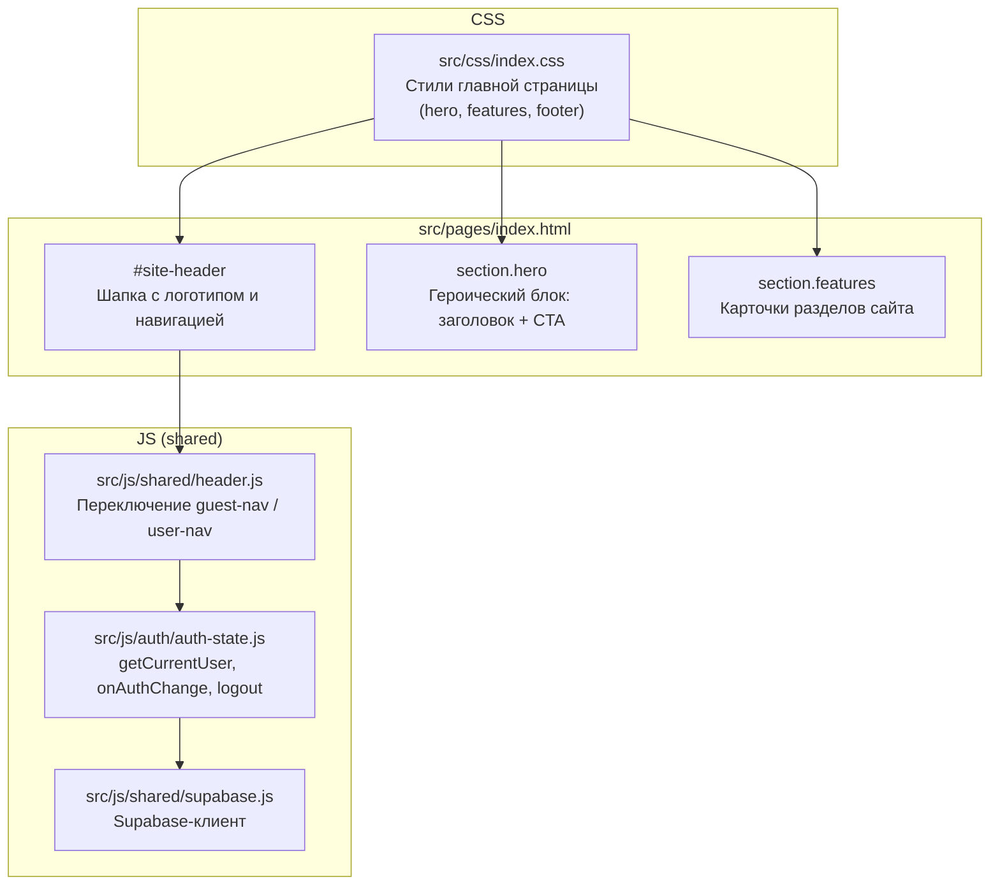
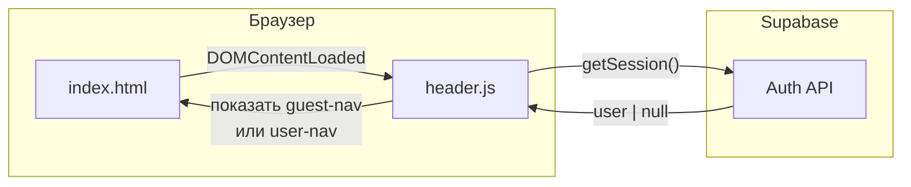
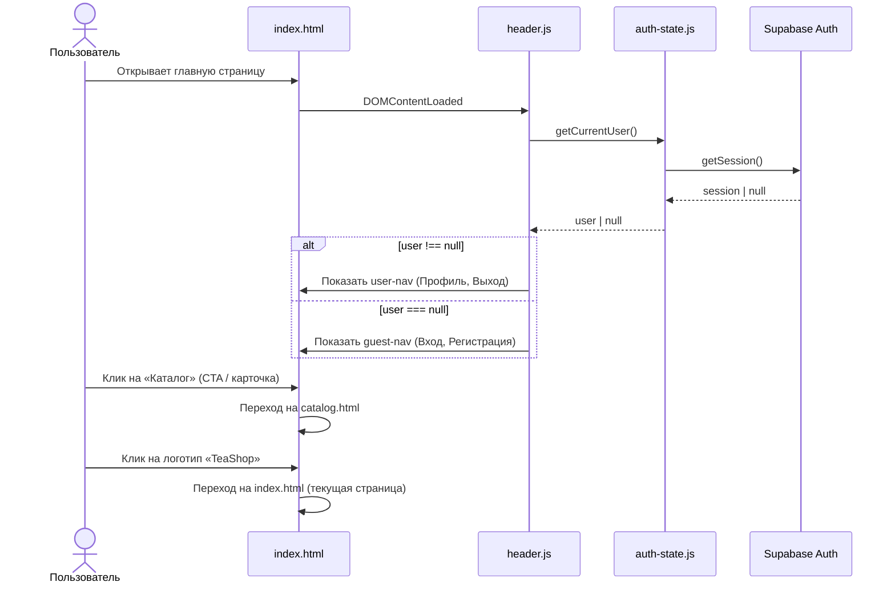

# DESIGN: Главная страница (index.html)

> На основе: `docs/research/research_index-homepage.md`
> Примечание: разработчик планирует доработать визуальный дизайн и фото позже в Google AI Studio.
> Данный документ описывает архитектуру и структуру, а не финальный визуал.

---

## 1. Диаграмма компонентов



Главная страница **не имеет собственного JS-модуля** — только `header.js` для auth-навигации.

---

## 2. Data flow



Данные из БД (таблицы чаёв и т.д.) **не запрашиваются**. Единственное обращение к Supabase — проверка auth-сессии через `header.js`.

---

## 3. Sequence-диаграмма



---

## 4. Изменения в схеме БД

**Нет.** Главная страница — статическая витрина. Новые таблицы, поля и RLS-политики не требуются.

---

## 5. ADR: Размещение index.html

### Контекст

Нужно решить, где разместить `index.html`:
- **Вариант A**: в корне проекта (`./index.html`)
- **Вариант B**: в `src/pages/index.html` (рядом с остальными HTML)

### Решение: **Вариант B — `src/pages/index.html`**

### Обоснование

| Критерий | Вариант A (корень) | Вариант B (src/pages/) |
|----------|-------------------|----------------------|
| Консистентность с другими HTML | Нарушена — все HTML в `src/pages/`, а index отдельно | Сохранена |
| Пути к CSS/JS | `src/css/index.css`, `src/js/shared/header.js` — отличаются от остальных страниц | `../css/index.css`, `../js/shared/header.js` — как у всех |
| Ссылки между страницами | Из index на другие: `src/pages/login.html` — громоздко | `login.html`, `catalog.html` — просто |
| Ссылка логотипа `href="/"` | Работает как есть (на web-сервере) | Нужно изменить на `index.html` |
| Работа через `file://` | `href="/"` не работает в обоих случаях | `href="index.html"` работает |

**Главный аргумент**: все ссылки между страницами остаются простыми относительными путями (`catalog.html`, `login.html`). Не нужно вводить разные форматы путей.

### Последствия

Нужно обновить `href` логотипа во **всех** существующих страницах:
```
href="/"  →  href="index.html"
```

И в `header.js` (строка 47):
```
window.location.href = '/'  →  window.location.href = 'index.html'
```

Это 5 точечных изменений (4 HTML + 1 JS), но зато архитектура остаётся единообразной.

---

## 6. HTML-структура главной страницы

> Визуальный дизайн будет доработан в Google AI Studio.
> Здесь — минимальная архитектурная структура.

```
index.html
├── <head>
│   ├── meta charset, viewport
│   ├── <title>TeaShop — Чайный магазин</title>
│   ├── Supabase CDN (для header.js → auth)
│   ├── <link> → ../css/index.css
│   └── <script type="module"> → ../js/shared/header.js
│
├── <header id="site-header">     ← стандартная шапка (как на всех страницах)
│   ├── <a href="index.html" class="logo">TeaShop</a>
│   ├── <nav id="guest-nav">      ← Вход / Регистрация
│   └── <nav id="user-nav">       ← Профиль / Выход
│
├── <main class="home-page">
│   ├── <section class="hero">
│   │   ├── <h1> — заголовок магазина
│   │   ├── <p> — краткое описание
│   │   └── <a> CTA — «Перейти в каталог» → catalog.html
│   │
│   └── <section class="features">
│       ├── Карточка «Каталог чаёв» → catalog.html
│       ├── Карточка «Конструктор смесей» → constructor.html (будущее)
│       └── Карточка «Личный кабинет» → profile.html
│
└── <footer>                       ← опционально, базовый футер
    └── © TeaShop
```

---

## 7. CSS-архитектура

Файл: `src/css/index.css`

Содержит:
- **Сброс и base** — дублирует `auth.css` (учебный проект, без общего `global.css`)
- **Стили шапки** — дублирует из `auth.css` (тот же паттерн, что `catalog.css`)
- **`.hero`** — героический блок (фон, центрирование, типографика)
- **`.features`** — сетка карточек разделов (CSS Grid или Flexbox)
- **Адаптивность** — от 375px, breakpoint 768px (как в `auth.css`)

Акцентный цвет: `#2e7d32` (единый для всего проекта).

---

## 8. Список изменений (scope)

| Действие | Файл | Что именно |
|----------|------|-----------|
| Создать | `src/pages/index.html` | Главная страница |
| Создать | `src/css/index.css` | Стили главной |
| Изменить | `src/pages/login.html` | `href="/"` → `href="index.html"` |
| Изменить | `src/pages/register.html` | `href="/"` → `href="index.html"` |
| Изменить | `src/pages/profile.html` | `href="/"` → `href="index.html"` |
| Изменить | `src/pages/catalog.html` | `href="/"` → `href="index.html"` |
| Изменить | `src/js/shared/header.js` | `'/'` → `'index.html'` в redirect после logout |

---

## Проверка перед передачей в PLAN

- [x] Модульность не нарушена — новых JS-модулей не создаётся, используется существующий `header.js`
- [x] RLS не затрагивается — страница статическая
- [x] Серверная логика не добавляется — всё на клиенте
- [x] Sequence-диаграмма логична — единственный запрос к Supabase через `header.js`