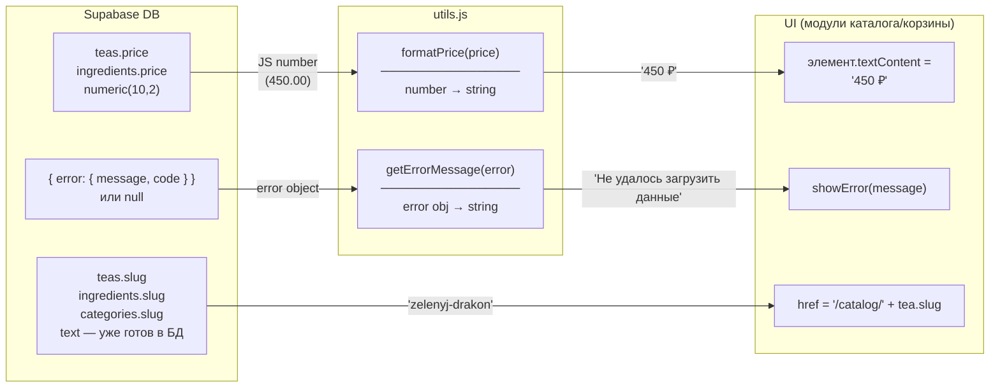
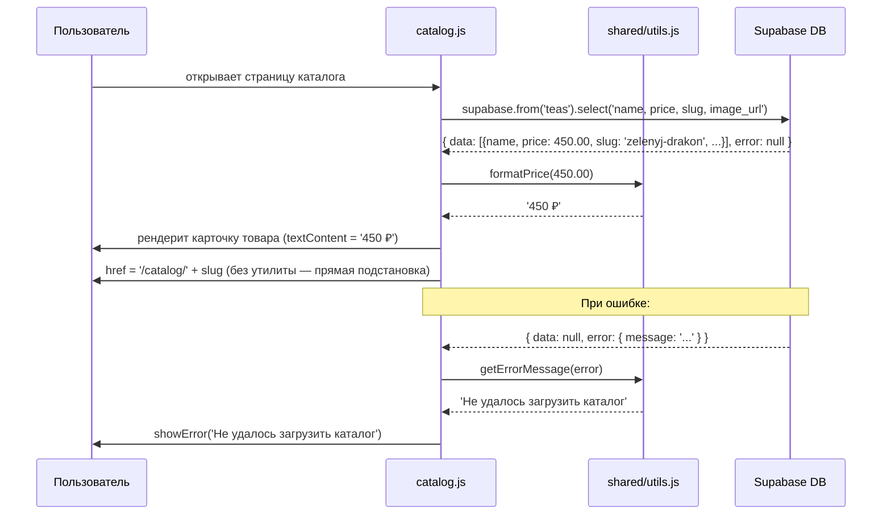

# DESIGN: shared/utils.js — форматирование цен, обработка ошибок Supabase

## Итог анализа

`slugify()` в браузере **не нужна** — см. ADR-1.
Модуль содержит две функции: `formatPrice()` и `getErrorMessage()`.

---

## 1. Диаграмма компонентов

```mermaid
graph TD
    subgraph shared
        utils["utils.js\n─────────────\nformatPrice()\ngetErrorMessage()"]
        supabase["supabase.js\nsupabase client"]
        config["config.js\nSUPABASE_URL\nSUPABASE_ANON_KEY"]
    end

    subgraph "будущие модули (потребители)"
        catalog["catalog/\ncatalog.js"]
        constructor["constructor/\nconstructor.js"]
        cart["cart/\ncart.js"]
    end

    subgraph "существующие модули"
        auth_state["auth/auth-state.js"]
        profile["auth/profile.js"]
        header["shared/header.js"]
    end

    config --> supabase
    utils -.->|"formatPrice,\ngetErrorMessage"| catalog
    utils -.->|"formatPrice,\ngetErrorMessage"| constructor
    utils -.->|"formatPrice,\ngetErrorMessage"| cart

    note["Существующие модули НЕ\nрефакторятся — только\nновые модули импортируют utils"]
    style note fill:#fffbe6,stroke:#f0c040
```

**Примечание**: `auth/`, `header.js` `utils.js` не используют — их паттерны обработки
ошибок уже реализованы и трогаться не будут. `utils.js` — для новых модулей.

---

## 2. Data Flow диаграмма



---

## 3. Sequence диаграмма (пример: загрузка каталога)



---

## 4. Изменения схемы БД

**Нет.** Все нужные поля уже есть:
- `teas.price` — `numeric(10,2)` ✓
- `ingredients.price` — `numeric(10,2)` ✓
- `teas.slug`, `ingredients.slug`, `categories.slug` — `text UNIQUE` ✓
- RLS для каталога — публичное чтение уже настроено ✓

---

## 5. ADR (Architecture Decision Records)

### ADR-1: slugify() — нужна ли генерация slug на клиенте?

**Контекст**: Research предполагал транслитерацию русских названий в slug.
Изучение схемы показало: поля `slug` уже есть во всех каталожных таблицах
(`teas`, `ingredients`, `categories`), заполняются WPF-приложением через `service_role`.

**Решение**: `slugify()` **не реализуется**.

**Причины**:
1. Slug берётся из БД — клиент его только читает
2. `recipes` не имеет поля `slug` — используется `id` (UUID)
3. Дублирование логики WPF в браузере без надобности

**Следствие**: для URL используется прямая подстановка `tea.slug` без утилиты.

---

### ADR-2: formatPrice — Intl.NumberFormat vs ручное форматирование?

**Контекст**: Цена хранится как `numeric(10,2)`, приходит как JS `number`.
Нужно отображать в рублях.

**Варианты**:

| | `Intl.NumberFormat` | Ручная конкатенация |
|---|---|---|
| Синтаксис | `new Intl.NumberFormat('ru-RU', { style: 'currency', currency: 'RUB' })` | `` `${Math.round(price)} ₽` `` |
| Результат | `"450,00 ₽"` (с копейками и пробелом, зависит от браузера) | `"450 ₽"` (предсказуемо) |
| Поддержка | Все современные браузеры | ES6+ |
| Сложность | Требует настройки опций | Минимальна |
| Копейки | Всегда показывает `.00` | Можно управлять |

**Решение**: **ручная конкатенация** со знаком `₽`.

**Причины**:
1. Проект учебный — простота важнее интернационализации
2. `Intl.NumberFormat` показывает `"450,00 ₽"` — избыточно для цен без копеек
3. Цены в каталоге — целые числа (по схеме БД цена ≥ 0, практически — рубли)
4. Если нужны копейки (например, `450.50 ₽`) — условное форматирование проще Intl

**Формат вывода**: `"450 ₽"` для целых, `"450,50 ₽"` для дробных.

---

### ADR-3: getErrorMessage — что делает утилита?

**Контекст**: Каждый модуль сам отображает ошибки. Суть проблемы:
- Supabase возвращает технические сообщения (`"relation does not exist"`)
- Нужно показывать пользователю понятный текст
- `console.error()` должен логировать оригинал

**Варианты**:

| | Полный централизованный обработчик | Только нормализация сообщения |
|---|---|---|
| Что делает | логирует + показывает ошибку в UI | возвращает строку, показ — на модуле |
| Проблема | нужна ссылка на DOM-элемент | чистое разделение ответственности |

**Решение**: `getErrorMessage(error, context)` **только нормализует** — возвращает строку.
Логирование и отображение — ответственность вызывающего модуля.

**Причина**: утилита не должна знать про DOM. Каждый модуль сам решает, куда показать ошибку.

**Сигнатура**:
```
getErrorMessage(error: SupabaseError | Error | null, context?: string): string
```

**Поведение**:
- `error` с `message` → возвращает читаемую строку
- Сетевая ошибка (нет интернета) → специальное сообщение
- `null` / неизвестный тип → fallback-строка

---

## Итоговый контракт модуля

```
src/js/shared/utils.js
─────────────────────
export function formatPrice(price: number): string
  Принимает: число (450 | 450.5)
  Возвращает: строку '450 ₽' | '450,50 ₽'

export function getErrorMessage(error, context?: string): string
  Принимает: объект ошибки Supabase или Error, опциональный контекст
  Возвращает: строку для показа пользователю на русском
  Побочный эффект: console.error() с контекстом и оригинальной ошибкой

Импортируется в: catalog/, constructor/, cart/
НЕ импортируется в: auth/ (там своя обработка уже есть)
Не импортирует: supabase.js, config.js (чистые функции)
```
