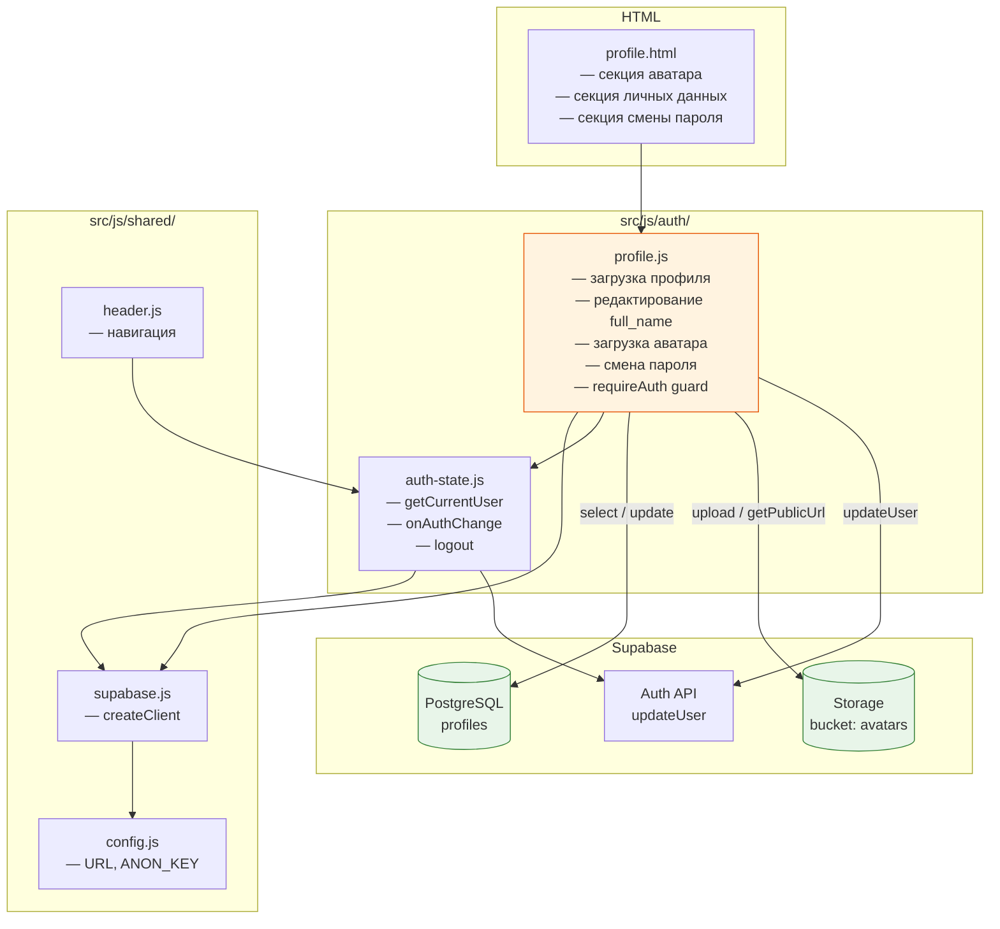
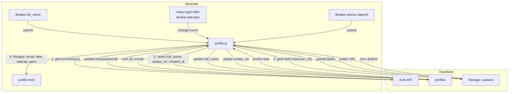
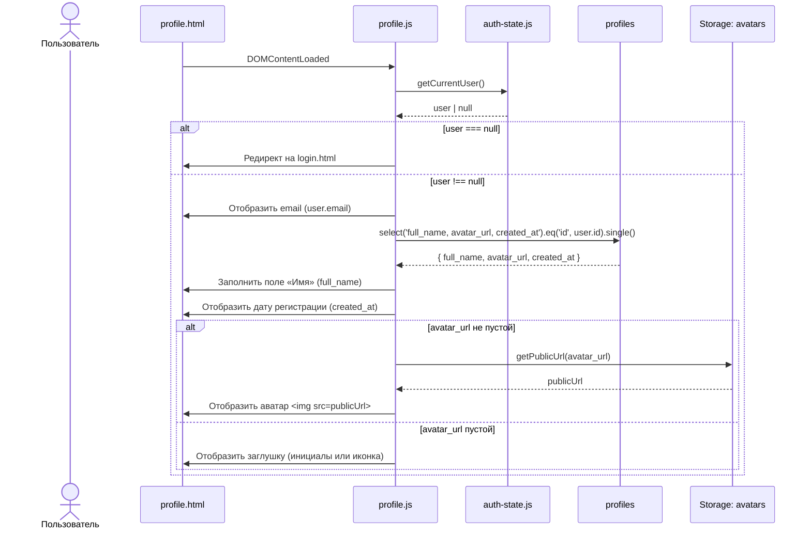
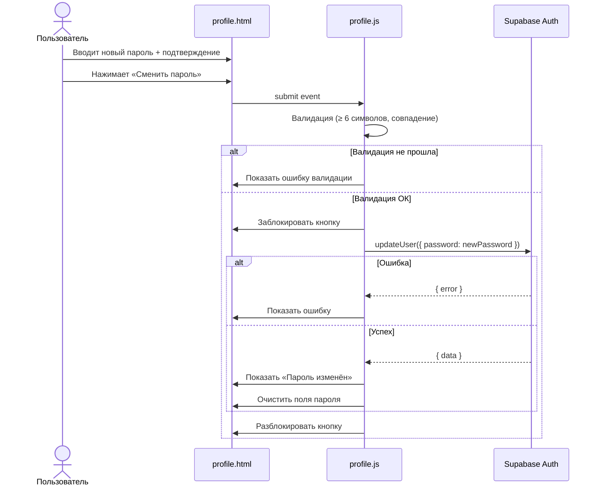

# DESIGN: Профиль пользователя — расширение и оформление

**Дата:** 2026-03-10
**Фаза:** DESIGN
**Основание:** `docs/research/research_user-profile.md`

---

## 0. Scope — что расширяем

Страница профиля (`profile.html`) уже существует с минимальным функционалом:
отображение email и редактирование `full_name`. Задача — довести до полноценной
страницы профиля.

**Новый функционал:**

| # | Функция | Источник данных |
|---|---------|----------------|
| 1 | Загрузка и отображение аватара | Supabase Storage (`avatars`) + `profiles.avatar_url` |
| 2 | Смена пароля | `supabase.auth.updateUser()` |
| 3 | Отображение даты регистрации | `profiles.created_at` |
| 4 | Полноценное оформление страницы | CSS (секции, визуальное разделение) |

**Не входит в scope:**
- Смена email (требует подтверждения, избыточно для учебного проекта)
- Удаление аккаунта (деструктивная операция, не предусмотрена brief)

---

## 1. Диаграмма компонентов



### Ключевое изменение

`profile.js` остаётся единственным JS-файлом страницы, но получает два новых
взаимодействия:
- **Supabase Storage** — загрузка/получение аватара
- **Supabase Auth API** — смена пароля через `updateUser`

Новых JS-модулей не создаётся — вся логика профиля концентрируется в одном файле.

---

## 2. Data flow



### Потоки данных

**Загрузка профиля (при открытии):**
1. `getCurrentUser()` → получаем `user.id`, `user.email`
2. `supabase.from('profiles').select('full_name, avatar_url, created_at')` → данные профиля
3. Если `avatar_url` не пустой → `supabase.storage.from('avatars').getPublicUrl(avatar_url)` → URL картинки
4. Рендерим: email, имя, аватар (или заглушка), дату регистрации

**Загрузка аватара:**
1. Пользователь выбирает файл через `<input type="file">`
2. Валидация: тип (image/*), размер (≤ 2 МБ)
3. Upload: `supabase.storage.from('avatars').upload(path, file, { upsert: true })`
4. Путь файла: `{user.id}` (без расширения — `upsert` перезаписывает)
5. Сохраняем путь: `supabase.from('profiles').update({ avatar_url: path })`
6. Обновляем `` с новым публичным URL

**Смена пароля:**
1. Пользователь вводит новый пароль + подтверждение
2. Валидация: длина ≥ 6, совпадение
3. `supabase.auth.updateUser({ password: newPassword })`
4. Показываем статус (успех / ошибка)

---

## 3. Sequence-диаграммы

### 3.1 Загрузка страницы профиля (расширенная)



### 3.2 Загрузка аватара

```mermaid
sequenceDiagram
    actor U as Пользователь
    participant F as profile.html
    participant JS as profile.js
    participant STR as Storage: avatars
    participant DB as profiles

    U->>F: Нажимает на аватар / кнопку «Изменить»
    F->>F: Открывается <input type="file">
    U->>F: Выбирает файл
    F->>JS: change event

    JS->>JS: Валидация (тип image/*, размер ≤ 2 МБ)
    alt Валидация не прошла
        JS->>F: Показать ошибку
    else Валидация ОК
        JS->>F: Показать индикатор загрузки
        JS->>STR: upload(user.id, file, { upsert: true })
        alt Ошибка загрузки
            STR-->>JS: { error }
            JS->>F: Показать ошибку
        else Успех
            STR-->>JS: { data: { path } }
            JS->>DB: update({ avatar_url: path, updated_at }).eq('id', user.id)
            DB-->>JS: OK
            JS->>STR: getPublicUrl(path)
            STR-->>JS: publicUrl
            JS->>F: Обновить <img src=publicUrl>
            JS->>F: Показать «Аватар обновлён»
        end
    end
```



### 3.3 Смена пароля



### 3.4 Сохранение имени (без изменений)

Логика сохранения `full_name` остаётся прежней — `supabase.from('profiles').update(...)`.

---

## 4. Изменения в схеме БД / Storage

### 4.1 Таблица `profiles` — без изменений

Все нужные поля уже есть: `full_name`, `avatar_url`, `created_at`, `updated_at`.

### 4.2 Supabase Storage — новый bucket `avatars`

Создаётся через Supabase Dashboard (или SQL):

```sql
-- Создание bucket (выполняется в Supabase Dashboard → Storage → New bucket)
-- Имя: avatars
-- Public: true (чтобы изображения были доступны по URL без авторизации)
-- File size limit: 2 MB
-- Allowed MIME types: image/jpeg, image/png, image/webp
```

### 4.3 RLS-политики Storage

```sql
-- Политика: пользователь может загружать только свой аватар
-- Путь файла: {user_id} (без расширения, upsert)
CREATE POLICY "Аватар: загрузка своего"
ON storage.objects FOR INSERT
WITH CHECK (
    bucket_id = 'avatars'
    AND auth.uid()::text = name
);

-- Политика: пользователь может перезаписать свой аватар
CREATE POLICY "Аватар: обновление своего"
ON storage.objects FOR UPDATE
USING (
    bucket_id = 'avatars'
    AND auth.uid()::text = name
);

-- Политика: публичное чтение (bucket public, но политика нужна)
CREATE POLICY "Аватар: публичное чтение"
ON storage.objects FOR SELECT
USING (bucket_id = 'avatars');
```

### 4.4 Новых SQL-миграций для таблиц не требуется

---

## 5. Структура HTML-страницы (секции)

```
profile.html
├── <header> — навигация (без изменений)
└── <main class="auth-page">
    └── <div class="profile-card"> (расширение auth-card)
        ├── <h1> «Профиль»
        │
        ├── Секция 1: АВАТАР
        │   ├── <div class="profile-avatar-section">
        │   │   ├──  или заглушка
        │   │   ├── <input type="file" id="avatar-input" hidden>
        │   │   └── <button id="avatar-change-btn"> «Изменить фото»
        │   └── <p id="avatar-status">
        │
        ├── Секция 2: ЛИЧНЫЕ ДАННЫЕ
        │   ├── <div class="profile-info-section">
        │   │   ├── Email (только чтение)
        │   │   ├── Дата регистрации (только чтение)
        │   │   └── <form id="profile-form">
        │   │       ├── <input id="full-name">
        │   │       └── <button> «Сохранить»
        │   └── <p id="profile-status">
        │
        └── Секция 3: БЕЗОПАСНОСТЬ
            ├── <form id="password-form">
            │   ├── <input type="password" id="new-password">
            │   ├── <input type="password" id="new-password-confirm">
            │   └── <button> «Сменить пароль»
            └── <p id="password-status">
```

---

## 6. ADR: Архитектурные решения

### ADR-5: Хранение аватара — путь в Storage

**Контекст:** Нужно хранить аватар пользователя. Поле `avatar_url` в `profiles` уже существует. Вопрос: какой формат пути использовать в Storage?

**Варианты:**

| Вариант | Плюсы | Минусы |
|---|---|---|
| A: `{user_id}/{filename.ext}` | Уникальность имени файла, расширение видно | Накопление старых файлов при обновлении |
| B: `{user_id}` (без расширения, upsert) | Один файл на пользователя, автоматическая замена старого | Нет расширения в имени, но MIME определяется по Content-Type |

**Решение:** Вариант B — `{user_id}` с `upsert: true`.

**Обоснование:** Пользователь имеет ровно один аватар. При обновлении старый файл перезаписывается — нет мусора в Storage. MIME-тип определяется заголовком при загрузке, расширение в имени файла не обязательно. RLS-политика проще: `name = auth.uid()::text`. Для публичного URL добавляем `?t={timestamp}` для сброса кеша браузера.

---

### ADR-6: Смена пароля — без текущего пароля

**Контекст:** Стандартный UX при смене пароля — запрос текущего пароля для подтверждения. Но `supabase.auth.updateUser()` не требует текущий пароль (пользователь уже авторизован с JWT).

**Варианты:**

| Вариант | Плюсы | Минусы |
|---|---|---|
| A: Запрашивать текущий пароль + валидация через `signInWithPassword` | Привычный UX, защита от несанкционированной смены | Лишний запрос к Auth API, усложнение формы |
| B: Только новый пароль + подтверждение | Простота, Supabase гарантирует авторизацию через JWT | Менее привычный UX |

**Решение:** Вариант B — только новый пароль + подтверждение.

**Обоснование:** Учебный проект. Пользователь уже авторизован (проверен guard). JWT гарантирует, что запрос идёт от владельца аккаунта. Суть проверки текущего пароля — защита от чужого доступа к открытой сессии, что для учебного проекта избыточно.

---

### ADR-7: Заглушка аватара — CSS-инициалы

**Контекст:** Если пользователь не загрузил аватар, нужно показать заглушку.

**Варианты:**

| Вариант | Плюсы | Минусы |
|---|---|---|
| A: Статическая иконка (SVG/PNG) | Просто | Безлико, нужен файл иконки |
| B: CSS-круг с инициалами пользователя | Персонализировано, нет внешних файлов | Чуть больше JS для генерации инициалов |

**Решение:** Вариант B — CSS-круг с первой буквой имени (или email).

**Обоснование:** Визуально приятнее, персонализировано. Берётся первая буква `full_name`, а если имя пустое — первая буква `email`. Реализация: `<div class="avatar-placeholder">А</div>` с CSS-стилями (круг, фон, белая буква).

---

### ADR-8: Одна карточка или несколько секций

**Контекст:** Текущий профиль использует `auth-card` (400px, стиль как у login/register). Расширенный профиль содержит 3 блока (аватар, данные, пароль).

**Варианты:**

| Вариант | Плюсы | Минусы |
|---|---|---|
| A: Одна широкая карточка `profile-card` | Всё на одном экране, один скролл | Может быть длинной на мобильных |
| B: Несколько отдельных карточек (как настройки) | Визуальное разделение секций | Больше HTML, раздробленный вид |

**Решение:** Вариант A — одна карточка `profile-card` с визуальными разделителями секций (`border-bottom`).

**Обоснование:** Профиль содержит 3 секции — это укладывается в одну карточку без перегруза. Визуальное разделение через CSS-разделители (как уже сделано для `profile-email-section`). Ширина карточки увеличивается до `480px` на десктопе (вместо 400px у auth-card). На мобильных — естественный скролл.

---

## 7. CSS-структура (ключевые классы)

| Класс | Назначение |
|---|---|
| `.profile-card` | Расширение `.auth-card`, max-width 480px |
| `.profile-avatar-section` | Flex-контейнер: аватар + кнопка изменения, по центру |
| `.avatar-preview` | Круг 96×96px, `object-fit: cover`, `border-radius: 50%` |
| `.avatar-placeholder` | Круг 96×96px, фон #2e7d32, белая буква, шрифт 2rem |
| `.profile-info-section` | Секция данных: email, дата, форма имени |
| `.profile-security-section` | Секция смены пароля |
| `.section-title` | Заголовок секции (0.875rem, uppercase, spacing) |
| `.profile-readonly` | Стиль для read-only полей (email, дата) |
| `.status-message` | Общий стиль для статус-сообщений (переиспользуется) |

---

## 8. Чеклист перед выходом из DESIGN

- [x] Модульность соблюдена: вся логика профиля в `auth/profile.js`, shared не затронуты
- [x] RLS-политики: Storage-политики для bucket `avatars` определены
- [x] Серверная логика не добавляется — всё на клиенте через Supabase SDK
- [x] Sequence-диаграммы покрывают все сценарии: загрузка, аватар, пароль
- [x] ADR задокументированы: хранение аватара, смена пароля, заглушка, layout
- [x] Учтено поле `avatar_url` из существующей схемы — новых миграций таблиц не нужно
- [x] Supabase Storage — единственное новое внешнее изменение (bucket + политики)
